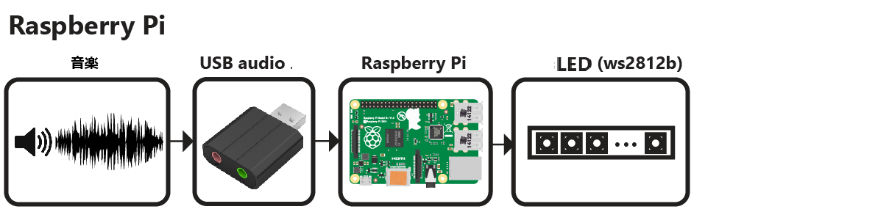
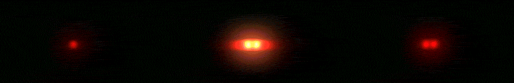
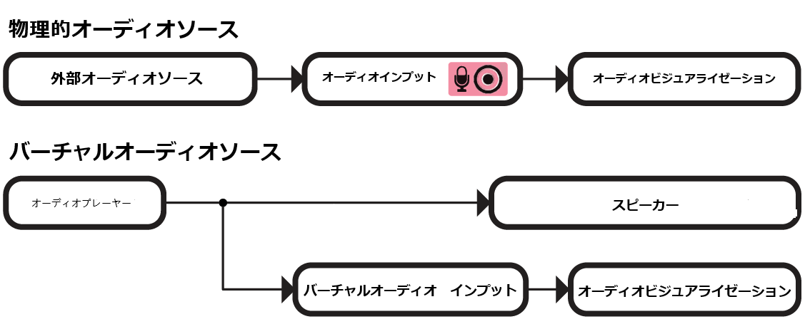
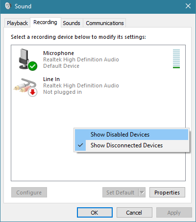
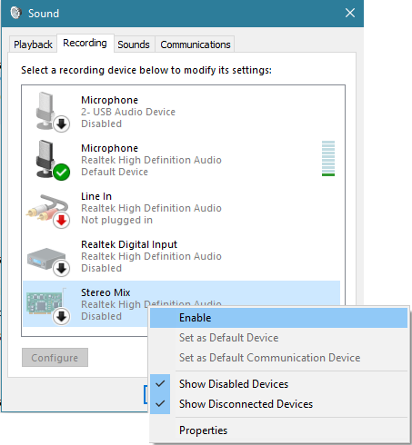

# オーディオ反応型 LED ストリップ
Python と ESP8266 または Raspberry Pi を使用して、LED ストリップの音楽をリアルタイムで視覚化します。





# デモ（ビデオを見るにはgifをクリック）

[](https://youtu.be/z4QHrDLL8C0?si=Rk9fIoPEwhUl2tO2)

# 概要
リポジトリには、LED ストリップ ミュージック ビジュアライザーを構築するために必要なものがすべて含まれています (ハードウェアを除く)。

- Python 視覚化コード。次のコードが含まれます。
  - マイクで音声を録音する ([microphone.py](python/microphone.py))
  - デジタル信号処理 ([dsp.py](python/dsp.py))
  - 1D 視覚化の構築 ([visualization.py](python/visualization.py))
  - ピクセル情報を WiFi 経由で ESP8266 に送信する([led.py](python/led.py))
  - 構成と設定 ([config.py](python/config.py))

# 作るには何が必要ですか?

## スタンドアロン Raspberry Pi
Raspberry Pi を使用してスタンドアロン ビジュアライザーを構築することもできます。そのためには次のものが必要です。
- ラズベリーパイ（1、2、または3）
- USB オーディオ入力デバイス。USB マイクまたはサウンド カードがこれに該当します。Raspberry Pi にオーディオ入力を提供する方法を見つける必要があります。
- WS2812B LED ストリップ (Adafruit Neopixels など)
- 5V電源
- 3.3V-5Vレベルシフター（オプション）

Raspberry Pi を使用する際の制限:
- Raspberry Pi は視覚化を実行するには十分な速度ですが、GUI ウィンドウを実行するには遅すぎます。Raspberry Pi でコードを実行するときは、GUI を無効にすることをお勧めします。

# コンピュータ  のインストール
## Python 依存関係
視覚化コードは Python 2.7 または 3.5 と互換性があります。いくつかの Python 依存関係もインストールする必要があります。
- Numpy
- Scipy (デジタル信号処理用)
- PyQtGraph (GUI 視覚化用)
- PyAudio (マイクで音声を録音する場合))

```

### インストールする
pip パッケージ マネージャーを使用して Python 依存関係をインストールすることもできます。```
pip install numpy
pip install scipy
pip install pyqtgraph
pip install pyaudio
```
 `pip` が見つからない場合は、 `python -m pip install`代わりに使用してみてください。


### ラズベリーパイ
Raspberry Pi は 3.3V デバイスなので、ロジック レベル コンバーターを使用して 3.3V ロジックを 5V ロジックにシフトするのがベスト プラクティスです (WS2812 LED は 5V ロジックを使用します)。ベスト プラクティスに関する優れた概要がここにあります。

ロジック レベル コンバーターを使用するのがベスト プラクティスですが、LED ストリップを Raspberry Pi に直接接続するだけでも機能する場合もあります。

Raspberry Pi GPIO ピンを使用して LED ストリップに電力を供給することはできません。外部 5V 電源が必要です。

接続は次のとおりです。

*電源のGNDをLEDストリップのGNDとRaspberry PiのGNDに接続します（共通のGND接続を共有する必要があります）
* 電源の+5VをLEDストリップの+5Vに接続します
* Raspberry Pi の PWM GPIO ピンを LED ストリップのデータ ピンに接続します。Raspberry Pi 2 または 3 を使用している場合は、ピン 18 (GPIO5) を試してください。

# セットアップと構成
1. PythonとPythonの依存関係をインストールする
2.このリポジトリ内のすべてのファイルをコンピュータにダウンロードして解凍します
4.  config.pyの場合:
  -  `N_PIXELS` LED ストリップ内の LED の数を設定します
  - 必要に応じて、`MIC_RATE` マイクのサンプリング レートを Hz 単位で設定します。ほとんどの場合、これを変更する必要はありません。

# Raspberry Piへのインストール
まず、このリポジトリ内のすべてのファイルをダウンロードして Pi に解凍します。


## Python依存関係のインストール
apt-getを使用してPythonの依存関係をインストールする
```
sudo apt-get update
sudo apt-get install python-numpy python-scipy python-pyaudio
```

## オーディオデバイスの設定
Raspberry Pi の場合、USB オーディオ デバイスをデフォルトのオーディオ デバイスとして設定する必要があります。

Create/edit `/etc/asound.conf`
```
sudo nano /etc/asound.conf
```
ファイルを次のテキストに設定します
```
pcm.!default {
    type hw
    card 1
}
ctl.!default {
    type hw
    card 1
}
```

次に、USBデバイスをデフォルトのデバイスとして設定します。`/usr/share/alsa/alsa.conf`
```
sudo nano /usr/share/alsa/alsa.conf
```
Change
```
defaults.ctl.card 0
defaults.pcm.card 0
```
To
```
defaults.ctl.card 1
defaults.pcm.card 1
```

## LEDストリップをテストする
1. cd rpi_ws281x/python/examples
2. sudo nano strandtest.py
3. ファイルの先頭にあるオプションを設定します。反転ロジックレベル コンバーターを使用している場合は、ロジック反転を有効にします。LED ストリップの正しい GPIO ピンとピクセル数を設定します。Raspberry Pi の 3.3V ロジックを ws2812b LED ストリップで使用される 5V ロジックに変換するには、ロジックレベル コンバーターが必要になる可能性があります。
4. 'sudo python strandtest.py'で例を実行します。

## 視覚化コードを構成する
config.pyでデバイスを'pi'に設定し、GPIO、LED、その他のハードウェア設定を構成してください。もし逆転論理レベルコンバータを使用している場合は、config.pyでLED_INVERT = Trueに設定してください。逆転論理レベルコンバータを使用していない場合（LEDストリップを直接GPIOピンに接続している場合）は、LED_INVERT = Falseに設定してください。

# オーディオ入力
このビジュアライゼーションプログラムは、オペレーティングシステムによって設定されたデフォルトのオーディオ入力デバイスからオーディオをストリーミングします。

典型的なオーディオソースの例:
* オーディオケーブルをオーディオ入力ジャックに接続 (Raspberry PiではUSBサウンドカードが必要)
* ウェブカムのマイク、ヘッドセット、スタジオ録音用マイクなど

## バーチャルオーディオソース
"バーチャルオーディオデバイス"を使用すると、あるアプリケーションのオーディオ再生を別のアプリケーションに転送できます。これにより、コンピュータで音楽を再生し、その再生をビジュアライゼーションプログラムに直接接続することが可能です。




### Windows
Windowsでは、"ステレオミックス"を使用してオーディオ出力ストリームをオーディオ入力にコピーできます。ステレオミックスは特定のオーディオチップセットのみサポートされています。もしお使いのチップセットがステレオミックスをサポートしていない場合は、Voicemeeterなどのサードパーティアプリケーションを使用できます。



Windowsのサウンド設定で録音デバイスに移動します (コントロールパネル -> サウンド)。右クリックメニューで「無効なデバイスを表示」を選択します。


ステレオミックスを有効にし、デフォルトのデバイスとして設定します。これでオーディオ再生がビジュアライゼーションプログラムのオーディオ入力ソースとして使用されます。オーディオチップセットがステレオミックスをサポートしていない場合は、リストに表示されません。

# ビジュアライゼーションの実行
すべてが設定されたら、visualization.pyを実行してビジュアライゼーションを開始します。ビジュアライゼーションは、自動的にデフォルトの録音デバイス（マイク）をオーディオ入力として使用します。

PyQtGraph GUIが開き、コンピュータ上でビジュアライゼーションの出力が表示されます。このGUI表示を有効/無効にする設定はconfig.pyで行うことができます。 [config.py](python/config.py)


